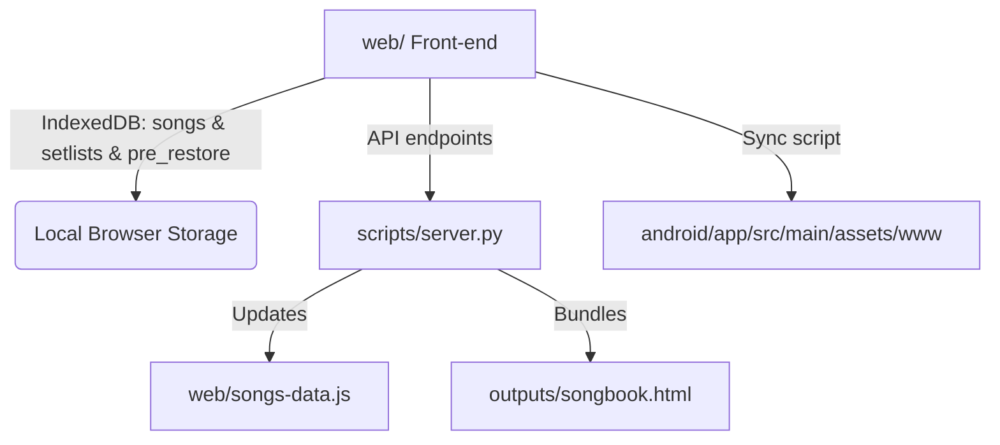

# ChordBook - Digital Songbook & Chord Viewer

ChordBook is a modern, responsive, and offline-first digital songbook application. It displays lyric sheets with chords positioned exactly above the lyrics, supports interactive guitar/piano chord diagrams, and enables live-performance helpers like auto-scroll, a visual/audio metronome, wake-locks, and a distraction-free fullscreen mode.

It is distributed as both a **standalone portable HTML sheet** (for any browser or device) and a **native Android App** wrapper utilizing an offline WebView.

---

## 🚀 Key Features

* **Dynamic Transposition**: Instantly transpose chords up or down (+/- 11 semitones) and toggle between sharps (`#`) and flats (`b`) enharmonic representations.
* **Interactive Chord Diagrams**: Hover or tap on any chord to display interactive SVG fingering diagrams for **Guitar** or **Piano** (powered by a custom chord database).
* **Metronome**: Built-in visual/audio metronome supporting multiple time signatures (`2/4`, `3/4`, `4/4`, `6/8`) and tap/BPM controls.
* **Auto-Scroll**: Hands-free scrolling powered by a smooth sub-pixel rendering engine. Autoscrolling speed is adjustable via an exponential 10-level controller, designed to perfectly match any performance tempo from extremely slow to very fast. Features scroll-syncing that preserves autoscroll speed after manual adjustments.
* **Built-in Visual Song Editor**: A markup-based song editor directly in the app. Includes:
  * A formatting toolbar with visual SVG icons for toggling **Bold** (`**text**`), **Yellow Highlight** (`::text::`), and **Green Highlight** (`%%text%%`).
  * Direct file selection or drag-and-drop to **import and embed images** directly into the song sheet. Imported images are compressed and resized on the fly using a canvas-based scaling algorithm.
  * An option to toggle between full image display and a minimized placeholder/thumbnail view in the editor, ensuring high editing performance with zero input lag.
* **Theme Customization**: Tailored, high-quality themes (Light, Dark, Sepia, and OLED Black) to ensure optimal legibility under any lighting conditions, with full rendering support for bold elements and colored highlights.
* **Setlist Management**: Create custom setlists, reorder songs, adjust individual song transposition settings per setlist, and import/export setlists as JSON.
* **Database Backup, Restore & Revert**:
  * Export complete database backup as a `.json` file.
  * Restore database from backup JSON/JS files using the **Restore Database Manager** modal (accessed from the sidebar footer), which displays a detailed change summary (additions, modifications, and deletions).
  * Revert to the database's previous state prior to the last restore operation using the yellow **Undo Last Restore** button. This safety feature works both online (via server backups) and offline (via browser IndexedDB backups).
* **Distraction-Free Fullscreen Mode**:
  * Click the **Maximize** button in the toolbar to enter fullscreen mode.
  * Hides both the sidebar and the toolbar, expanding the song sheet area to take up 100% of the screen.
  * Displays a floating glassmorphic minimized controls panel overlay, allowing performance control (Play/Pause, speed adjustment, and maximize toggle) directly on-screen.
  * Supports pressing the `Escape` key to exit.

---

## 🛠️ Project Architecture



### 1. Web Front-end (`web/`)
A pure, framework-less frontend built with standard HTML5, CSS3, and Vanilla JavaScript. 
* **IndexedDB Store**: Manages custom user-added songs, setlists, and a `pre_restore` safety backup store.
* **Static Fallback**: Reads default songs from [songs-data.js](file:///c:/dev/songbook/web/songs-data.js) (automatically updated by the build pipeline).

### 2. Standalone HTML (`outputs/songbook.html`)
A single, highly portable, standalone application generated in the `outputs/` directory of the workspace. All JS libraries, stylesheets, and song databases are fully inlined.

### 3. Android WebView Integration (`android/`)
A native Android project configured to wrap the web assets locally in a WebView. Web assets are hosted in `android/app/src/main/assets/www` to run offline without any remote network requests.

---

## 📋 Dev Scripts & Pipeline

All utility scripts are written in Python and located in the [scripts/](file:///c:/dev/songbook/scripts) directory.

### 1. Development & Sync Server
Run the local dev server to host the web app and capture song edits made directly in the UI to save them back to your local disk:
```bash
python scripts/server.py
```
* **Default Port**: `8080` (can be overridden, e.g. `python scripts/server.py 9000`).
* Serves the front-end at `http://localhost:8080`.
* **Sync API Endpoints**:
  - `POST /api/save-song`: Automatically writes edits to `scripts/manual_edits.json`, updates `web/songs-data.js`, and rebuilds assets.
  - `POST /api/delete-song`: Synchronizes song deletions across edits and main files on disk.
  - `POST /api/restore-backup`: Restores a user-uploaded database backup, performs a safety backup of disk configurations, aligns `manual_edits.json` automatically, and triggers a clean rebuild.
  - `GET /api/check-undo-available`: Checks if a pre-restore backup exists on disk.
  - `POST /api/undo-restore`: Reverts `songs-data.js` and `manual_edits.json` back to their exact pre-restoration states.

### 2. Standalone HTML Bundler
Inlines all frontend assets (HTML, CSS, JS, external libraries, and song data) into a single standalone file in `outputs/`:
```bash
python scripts/bundle_app.py
```

### 3. Android Project Sync
Synchronizes the compiled web frontend files directly with the Android project's assets:
```bash
python scripts/sync_android.py
```

### 4. Docx Word Document Parser
Imports and parses `.docx` songsheets from the `import_songs/` directory:
```bash
python scripts/parse_docs.py
```
* Parses `.docx` file zip structure natively without external Python library dependencies.
* Identifies RTL (Hebrew) vs LTR (English) songs automatically.
* Extracts inline drawings/images to `web/media/`.
* Queries the iTunes Search API to lookup missing artist names and translates them into Hebrew where appropriate, caching results to avoid rate limits.

---

## 🏗️ Build Guide

### 1. Web Release Build
Run the following script to bundle your files into a single HTML document:
```bash
python scripts/bundle_app.py
```
The output file [songbook.html](file:///c:/Develop/Github/songbook/outputs/songbook.html) can be opened in any browser.

### 2. Android APK Release Build
1. Sync the latest web changes with the Android assets folder:
   ```bash
   python scripts/sync_android.py
   ```
2. Build the release APK via Gradle (requires JDK 17 or 21):
   ```bash
   cd android
   $env:JAVA_HOME="C:\Program Files\Android\openjdk\jdk-21.0.8" # Set JDK home if necessary
   ./gradlew assembleRelease
   ```
3. The resulting signed APK will be built at `android/app/build/outputs/apk/release/app-release.apk`.

---

## 🆕 Release History & Changelog

### Version 1.5.5  (Current)
* **Firebase Cloud Sync**: Migrated to a cloud-first architecture using Firebase Firestore. Songs and setlists are now securely synced across all devices in real-time.
* **Google Authentication**: Added Google Sign-In support. Users can securely log in to access their cloud-saved songs.
* **Public & Private Setlists**: Added the ability to toggle setlists between Public (shared) and Private (personal). Easily share setlists with band members via a public URL.
* **Streamlined Toolbar UI**: Fully reorganized and compressed the main toolbar into a responsive, single-line layout grouped into Operation, Display, and Management sections. Replaced bulky toggles with sleek modern SVG icons.

### Version 1.5.1
* **Firebase Song Deletion Fix**: Resolved issues with deleting songs from Firestore. Implemented database tombstones for default songs deletion, immediate local UI refresh, and automatic active song switching.
* **WebView Firebase Sync**: Refactored the Android app to use `WebViewAssetLoader` (routing through `https://appassets.androidplatform.net`), allowing Firebase Auth and Firestore to sync correctly inside the WebView context.
* **Pre-build Asset Sync**: Hooked the HTML/JS bundler into Gradle's `preBuild` task to guarantee that the compiled APK always contains the most up-to-date song assets.


### Version 1.2.3
* **HTML and APK Production Rebuild**: Bundled standalone HTML and built native Android wrapper APK.

### Version 1.2.2
* **Smooth Sub-Pixel Autoscrolling**: Refactored the autoscroll engine to use sub-pixel increments, providing a buttery-smooth experience.
* **10-Step Exponential Autoscroll Speed**: Replaced the linear slider with a 10-level exponential range selector, allowing fine control over slow speeds and rapid pacing.
* **Autoscroll Manual Sync**: Standardized scroll-syncing so that if a musician manually scrolls during play, autoscrolling seamlessly resumes without resetting the speed or causing stutter.
* **Glassmorphic Fullscreen Overlay**: Fullscreen mode now overlays a floating, minimized glassmorphic control bar containing play/pause, autoscroll speed, and exit buttons.
* **Visual Editor Toolbar**: Embedded SVG icon buttons for Bold, Highlights (Yellow and Green), and Image Import inside the Edit Song modal.
* **Green Highlight (`%%`) Support**: Implemented a secondary green highlight markup parsed across all theme backgrounds.
* **Editor Media Placeholders**: Added a thumbnail/placeholder visibility toggle in the song editor to prevent editor DOM rendering lag on pages containing large embedded images.
* **On-the-Fly Image Compression**: Canvas-based automatic image resizing and quality optimization during file imports to minimize database and PDF payload sizes.

### Version 1.2.1
* **Database Backup, Restore & Revert**: Added JSON database export, structured restoration reports, and immediate one-click restore undo.
* **Distraction-Free Fullscreen**: Enter fullscreen mode via the maximize toolbar icon to hide all peripheral navigation controls.
