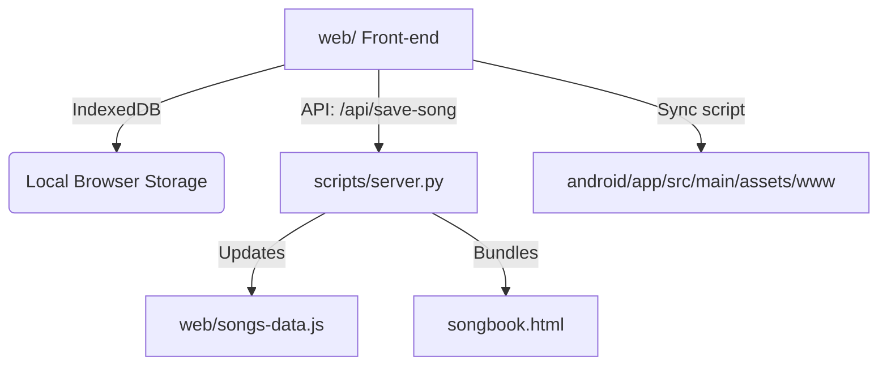

# ChordBook - Digital Songbook & Chord Viewer

ChordBook is a modern, responsive, and offline-first digital songbook application. It displays lyric sheets with chords positioned exactly above the lyrics, supports interactive guitar/piano chord diagrams, and enables live-performance helpers like auto-scroll, a visual/audio metronome, wake-locks, and a distraction-free fullscreen mode.

It is distributed as both a **standalone portable HTML sheet** (for any browser or device) and a **native Android App** wrapper utilizing an offline WebView.

---

## 🚀 Key Features

* **Dynamic Transposition**: Instantly transpose chords up or down (+/- 11 semitones) and toggle between sharps (`#`) and flats (`b`) enharmonic representations.
* **Interactive Chord Diagrams**: Hover or tap on any chord to display interactive SVG fingering diagrams for **Guitar** or **Piano** (powered by a custom chord database).
* **Metronome**: Built-in visual/audio metronome supporting multiple time signatures (`2/4`, `3/4`, `4/4`, `6/8`) and tap/BPM controls.
* **Auto-Scroll**: Hands-free scrolling with a customizable speed slider to keep page movement in sync with your playing speed.
* **Theme Customization**: Tailored, high-quality themes (Light, Dark, Sepia, and OLED Black) to ensure optimal legibility under any lighting conditions.
* **Setlist Management**: Create custom setlists, reorder songs, adjust individual song transposition settings per setlist, and import/export setlists as JSON.
* **Distraction-Free Maximize Mode (New)**:
  * Click the **Maximize** button in the toolbar to enter fullscreen mode.
  * Hides both the sidebar and the toolbar, expanding the song sheet area to take up 100% of the screen.
  * Displays a floating glassmorphic Restore button in the top-right corner to exit fullscreen.
  * Supports pressing the `Escape` key to exit.

---

## 🛠️ Project Architecture



### 1. Web Front-end (`web/`)
A pure, framework-less frontend built with standard HTML5, CSS3, and Vanilla JavaScript. 
* **IndexedDB Store**: Manages custom user-added songs and setlist data locally within the browser.
* **Static Fallback**: Reads default songs from [songs-data.js](file:///c:/Develop/Github/songbook/web/songs-data.js) (automatically updated by the build pipeline).

### 2. Standalone HTML (`songbook.html`)
A single, highly portable, standalone application generated at the root of the workspace. All JS libraries, stylesheets, and song databases are fully inlined.

### 3. Android WebView Integration (`android/`)
A native Android project configured to wrap the web assets locally in a WebView. Web assets are hosted in `android/app/src/main/assets/www` to run offline without any remote network requests.

---

## 📋 Dev Scripts & Pipeline

All utility scripts are written in Python and located in the [scripts/](file:///c:/Develop/Github/songbook/scripts) directory.

### 1. Development & Sync Server
Run the local dev server to host the web app and capture song edits made directly in the UI to save them back to your local disk:
```bash
python scripts/server.py
```
* **Default Port**: `8080` (can be overridden, e.g. `python scripts/server.py 9000`).
* Serves the front-end at `http://localhost:8080`.
* Listens to the `/api/save-song` endpoint and automatically writes edits to `scripts/manual_edits.json`, updates `web/songs-data.js`, and regenerates the standalone `songbook.html`.

### 2. Standalone HTML Bundler
Inlines all frontend assets (HTML, CSS, JS, external libraries, and song data) into a single standalone file at the root:
```bash
python scripts/bundle_app.py
```

### 3. Android Project Sync
Synchronizes the compiled web frontend files directly with the Android project's assets:
```bash
python scripts/sync_android.py
```

### 4. Docx Word Document Parser
Imports and parses `.docx` songsheets from the `import_songs/` directory:
```bash
python scripts/parse_docs.py
```
* Parses `.docx` file zip structure natively without external Python library dependencies.
* Identifies RTL (Hebrew) vs LTR (English) songs automatically.
* Extracts inline drawings/images to `web/media/`.
* Queries the iTunes Search API to lookup missing artist names and translates them into Hebrew where appropriate, caching results to avoid rate limits.

---

## 🏗️ Build Guide

### 1. Web Release Build
Run the following script to bundle your files into a single HTML document:
```bash
python scripts/bundle_app.py
```
The output file [songbook.html](file:///c:/Develop/Github/songbook/songbook.html) can be opened in any browser.

### 2. Android APK Release Build
1. Sync the latest web changes with the Android assets folder:
   ```bash
   python scripts/sync_android.py
   ```
2. Build the release APK via Gradle (requires JDK 17 or 21):
   ```bash
   cd android
   $env:JAVA_HOME="C:\Program Files\Android\openjdk\jdk-21.0.8" # Set JDK home if necessary
   ./gradlew assembleRelease
   ```
3. The resulting APK will be built at `android/app/build/outputs/apk/release/app-release-unsigned.apk`.
