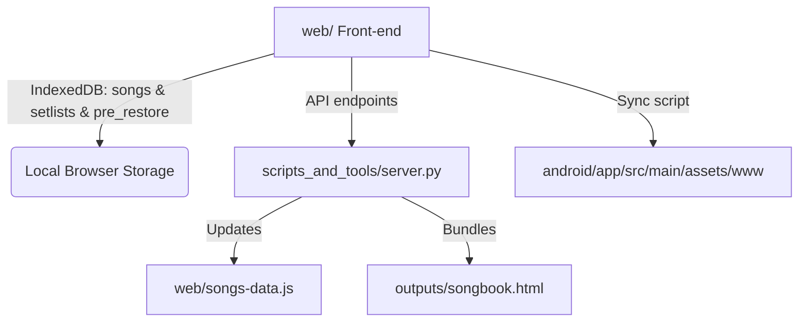

# ChordBook - Digital Songbook & Chord Viewer

ChordBook is a modern, responsive, and offline-first digital songbook application. It displays lyric sheets with chords positioned exactly above the lyrics, supports interactive guitar/piano chord diagrams, and enables live-performance helpers like auto-scroll, a visual/audio metronome, wake-locks, and a distraction-free fullscreen mode.

Songs can also carry engraved sheet music: a MusicXML score attached to a song is rendered inline under the lyrics, transposes together with the song, and can be edited note by note in a built-in score editor.

It is distributed as both a **standalone portable HTML sheet** (for any browser or device) and a **native Android App** wrapper utilizing an offline WebView.

---

## 🚀 Key Features

* **Dynamic Transposition**: Instantly transpose chords up or down (+/- 11 semitones) and toggle between sharps (`#`) and flats (`b`) enharmonic representations.
* **Interactive Chord Diagrams**: Hover or tap on any chord to display interactive SVG fingering diagrams for **Guitar** or **Piano** (powered by a custom chord database).
* **Sheet Music (MusicXML)**: Attach a `.xml`, `.musicxml` or compressed `.mxl` score to any song. It is engraved inline in the song sheet by [OpenSheetMusicDisplay](https://opensheetmusicdisplay.org/), re-laid-out whenever the column changes width, and **transposed together with the song** — pressing `KEY +/-` moves the notes, the key signature and the chord symbols, while the stored attachment itself is left untouched. A download button on the score exports the file exactly as it was attached (original key, and the original `.mxl` bytes when it was compressed).
* **Built-in Score Editor**: Press **Edit score** on an attachment in the song editor to open a three-tab editor above a live preview of the engraving:
  * **Notation** — click a note, a chord symbol or a bar in the rendered score and edit it in place: pitch and octave, note value (whole down to 16th) and dots, accidentals (`#`, `b`, natural, or back to the key signature), rest/note, ties, insert and delete note, insert and delete bar, and the time signature. Chord symbols can be typed onto a note, moved to the neighbouring note with **Move left/right** or dragged onto another note, and removed. Everything is also reachable from the keyboard (arrows for pitch and selection, `1`–`5` for note values, `.`, `#`, `b`, `n`, `r`, `t`, `Enter`, `Delete`) with 50 steps of Undo/Redo (`Ctrl+Z` / `Ctrl+Shift+Z`).
  * **Chords & Lyrics** — every chord symbol and every lyric syllable in the score as two bar-numbered lists, for quick text-only fixes. Clearing a field removes that chord or syllable; `Am7/G`-style slash chords are supported.
  * **XML** — the raw MusicXML in a text box, validated before it replaces the working copy: a document that does not parse stays in the box with its error message instead of breaking the score. Saving with unparsable XML pending is refused rather than silently dropped.
* **Metronome**: Built-in visual/audio metronome supporting multiple time signatures (`2/4`, `3/4`, `4/4`, `6/8`) and tap/BPM controls.
* **Auto-Scroll**: Hands-free scrolling powered by a smooth sub-pixel rendering engine. Autoscrolling speed is adjustable via an exponential 10-level controller, designed to perfectly match any performance tempo from extremely slow to very fast. Features scroll-syncing that preserves autoscroll speed after manual adjustments.
* **Built-in Visual Song Editor**: A markup-based song editor directly in the app. Includes:
  * A formatting toolbar with visual SVG icons for toggling **Bold** (`**text**`), **Yellow Highlight** (`==text==`), and **Green Highlight** (`%%text%%`).
  * An **Import MusicXML** button that attaches a score file at the cursor as a short `[MUSICXML: n]` token. The score is stored inside the song's own text, so it travels with the song through cloud sync, database backups and setlist exports.
  * A chip per attachment below the toolbar, with **Edit score**, **Export** and **Remove** actions (removing one renumbers the remaining tokens).
  * A **Preview** toggle that renders the song exactly as a reader sees it, engraved scores included.
  * Image embedding (`[IMAGE: ...]`) was removed in 1.7.0 — see the changelog below.
* **Theme Customization**: Tailored, high-quality themes (Light, Dark, Sepia, and OLED Black) to ensure optimal legibility under any lighting conditions, with full rendering support for bold elements and colored highlights.
* **Setlist Management**: Create custom setlists, reorder songs, adjust individual song transposition settings per setlist, and import/export setlists as JSON.
* **Database Backup, Restore & Revert**:
  * Export complete database backup as a `.json` file.
  * Restore database from backup JSON/JS files using the **Restore Database Manager** modal (accessed from the sidebar footer), which displays a detailed change summary (additions, modifications, and deletions).
  * Revert to the database's previous state prior to the last restore operation using the yellow **Undo Last Restore** button. This safety feature works both online (via server backups) and offline (via browser IndexedDB backups).
* **Distraction-Free Fullscreen Mode**:
  * Click the **Maximize** button in the toolbar to enter fullscreen mode.
  * Hides both the sidebar and the toolbar, expanding the song sheet area to take up 100% of the screen.
  * Displays a floating glassmorphic minimized controls panel overlay, allowing performance control (Play/Pause, speed adjustment, and maximize toggle) directly on-screen.
  * Supports pressing the `Escape` key to exit.

---

## 🛠️ Project Architecture


```mermaid
graph TD
    A[web/ Front-end] -->|IndexedDB: songs & setlists & pre_restore| B(Local Browser Storage)
    A -->|API endpoints| C[scripts_and_tools/server.py]
    C -->|Updates| D[web/songs-data.js]
    C -->|Bundles| E[outputs/songbook.html]
    A -->|Sync script| F[android/app/src/main/assets/www]
```

### 1. Web Front-end (`web/`)
A pure, framework-less frontend built with standard HTML5, CSS3, and Vanilla JavaScript (classic scripts, no bundler and no modules).
* **IndexedDB Store**: Manages custom user-added songs, setlists, and a `pre_restore` safety backup store.
* **Static Fallback**: Reads default songs from [songs-data.js](web/songs-data.js) (automatically updated by the build pipeline).
* **Song pipeline**: [parser.js](web/parser.js) turns raw song text into blocks (headers, chord/lyric pairs, `[MUSICXML: ...]` attachments) and [app.js](web/app.js) renders them.
* **MusicXML layer**:
  - [musicxml-tools.js](web/musicxml-tools.js) — pure helpers: decode/encode the `[MUSICXML: data:...]` payload (including unzipping `.mxl` through JSZip), transpose a whole score, validate XML, and read/write the chord symbols and lyrics. It decides by content rather than by MIME label and rejects anything that does not start like MusicXML, because OSMD treats a short non-XML string as a URL and would fetch it.
  - [musicxml-edit.js](web/musicxml-edit.js) — the locator core that maps what OSMD drew on screen back to the exact `<note>` / `<harmony>` element, plus every edit operation (pitch, duration, accidental, rest, tie, insert/delete note, bar and time-signature edits, chord add/move/remove). Each operation takes XML in and returns new XML; the input document is never mutated.
  - [OpenSheetMusicDisplay 1.8.8](https://opensheetmusicdisplay.org/) does the engraving. It is loaded from unpkg, so rendering a score needs network access on first load; everything else in the app is local.
* **Renderer sanity page**: [web/test/index.html](web/test/index.html) loads a `.xml`/`.mxl` file straight into OSMD, with two sample scores beside it, for checking the renderer without the app around it.

### 2. Standalone HTML (`outputs/songbook.html`)
A single, highly portable, standalone application generated in the `outputs/` directory of the workspace. All JS libraries, stylesheets, and song databases are fully inlined.
> **Note:** [bundle_app.py](scripts_and_tools/bundle_app.py) does not inline `musicxml-tools.js` / `musicxml-edit.js` yet, so the standalone HTML carries relative `<script src>` tags for them and cannot render or edit scores on its own. Use the `web/` app or the Android build for MusicXML until the bundler covers them.

### 3. Android WebView Integration (`android/`)
A native Android project configured to wrap the web assets locally in a WebView. Web assets are hosted in `android/app/src/main/assets/www` so the app works offline — apart from the Firebase SDKs, Google Fonts, and the OSMD script, which are still fetched over the network.

---

## 📋 Dev Scripts & Pipeline

All utility scripts are written in Python and located in the [scripts_and_tools/](scripts_and_tools/) directory.

### 1. Development & Sync Server
Run the local dev server to host the web app and capture song edits made directly in the UI to save them back to your local disk:
```bash
python scripts_and_tools/server.py
```
* **Default Port**: `8080` (can be overridden, e.g. `python scripts_and_tools/server.py 9000`).
* Serves the front-end at `http://localhost:8080`.
* **Sync API Endpoints**:
  - `POST /api/save-song`: Automatically writes edits to `scripts_and_tools/manual_edits.json`, updates `web/songs-data.js`, and rebuilds assets.
  - `POST /api/delete-song`: Synchronizes song deletions across edits and main files on disk.
  - `POST /api/restore-backup`: Restores a user-uploaded database backup, performs a safety backup of disk configurations, aligns `manual_edits.json` automatically, and triggers a clean rebuild.
  - `GET /api/check-undo-available`: Checks if a pre-restore backup exists on disk.
  - `POST /api/undo-restore`: Reverts `songs-data.js` and `manual_edits.json` back to their exact pre-restoration states.

### 2. Standalone HTML Bundler
Inlines all frontend assets (HTML, CSS, JS, external libraries, and song data) into a single standalone file in `outputs/`:
```bash
python scripts_and_tools/bundle_app.py
```

### 3. Android Project Sync
Synchronizes the compiled web frontend files directly with the Android project's assets:
```bash
python scripts_and_tools/sync_android.py
```

### 4. Docx Word Document Parser
Imports and parses `.docx` songsheets from the `import_songs/` directory:
```bash
python scripts_and_tools/parse_docs.py
```
* Parses `.docx` file zip structure natively without external Python library dependencies.
* Identifies RTL (Hebrew) vs LTR (English) songs automatically.
* Extracts inline drawings/images to `web/media/`.
* Queries the iTunes Search API to lookup missing artist names and translates them into Hebrew where appropriate, caching results to avoid rate limits.

---

## 🏗️ Build Guide

### 1. Web Release Build
Run the following script to bundle your files into a single HTML document:
```bash
python scripts_and_tools/bundle_app.py
```
The output file [songbook.html](outputs/songbook.html) can be opened in any browser.

### 2. Android APK Release Build
1. Sync the latest web changes with the Android assets folder:
   ```bash
   python scripts_and_tools/sync_android.py
   ```
2. Build the release APK via Gradle (requires JDK 17 or 21):
   ```bash
   cd android
   $env:JAVA_HOME="C:\Program Files\Android\openjdk\jdk-21.0.8" # Set JDK home if necessary
   ./gradlew assembleRelease
   ```
3. The resulting signed APK will be built at `android/app/build/outputs/apk/release/app-release.apk`.

---

## 🆕 Release History & Changelog

### Version 1.7.0  (Current)
* **MusicXML Scores in Songs**: Songs can now carry an engraved score. A `.xml`, `.musicxml` or `.mxl` file attached from the song editor is stored inside the song text as a `[MUSICXML: data:...]` token — so it syncs, backs up and exports with the song — and is drawn inline by OpenSheetMusicDisplay.
* **Scores Follow the Song's Key**: `KEY +/-` transposes the engraving along with the chord sheet (notes, key signature and chord symbols, spelled by generic interval so a third stays a third). Decoded and transposed scores are memoized per attachment and offset, so stepping through keys does not re-parse a large file on every press. The stored attachment always keeps its original key, and the download button on a score hands back the original bytes — `.mxl` stays `.mxl`.
* **Score Editor**: A three-tab editor (Notation / Chords & Lyrics / XML) over a live preview. All three tabs read and write one working copy, so switching between them never re-parses the score, and the XML tab keeps a draft that does not parse instead of discarding it. Saving an untouched score re-uses the original bytes rather than re-encoding it.
* **Direct Notation Editing**: Notes, chord symbols and bars are selected by clicking the rendered SVG, with a hit-test index built from the MusicXML timing (`<duration>`, `<backup>`, `<forward>`, `<chord/>`) replayed over every part and measure. Edits cover pitch, octave, note value and dots, accidentals, rest/note, ties, note and bar insert/delete, time signature, and chord symbols (type, add, move by note, drag, remove), with 50 steps of undo/redo and full keyboard control.
* **Rendering Fixes for Editability**: OSMD's page margins are trimmed to song-sheet padding, part names are suppressed, and multi-measure rest collapsing is switched off — collapsed bars get no graphical measure, so they could not be clicked or edited. OSMD instances are tracked in an app-level registry and driven by a `ResizeObserver`: its own `autoResize` registers a window listener it never removes, which left an immortal instance behind on every re-render.
* **Attachment Parsing Hardened**: `[MUSICXML: ...]` tokens are matched against their own closing bracket, so a second token on the same line is no longer folded into the first one's data URL. Attachment text is validated before it reaches `osmd.load()`, which would otherwise treat a short crafted token as a URL and issue an outbound request from every reader's browser.
* **Images Removed**: `[IMAGE: ...]` embedding is gone — the editor's image import, the on-the-fly compression and the thumbnail toggle with it. Legacy tokens are stripped when a song is opened for editing and ignored by the renderer, and the scans that were embedded in the database are archived under [songs_db/legacy_scans/](songs_db/legacy_scans/) with a `manifest.json` mapping each file to its song.

### Version 1.6.0
* **Consistent Chord Alignment Across Devices**: Chord-over-lyric positioning now matches between desktop and the Android app. Inter contains no Hebrew, so Hebrew lines used to fall through to whatever the platform called `sans-serif` (Arial on Windows, Noto/Roboto on Android) and the two lines of a pair were measured by different fonts. Rubik (Hebrew) and Arimo (Latin, metric-compatible with Arial) are now self-hosted from `fonts/` and pinned for both the rendered sheet and the editor textarea.
* **Offline Icons**: Material Symbols is self-hosted as a 29-icon subset (29 KB instead of the full ~4 MB set), so the offline Android WebView renders glyphs instead of the icon names as plain text. Adding a new icon name anywhere in the app requires regenerating the subset — see the note above the `@font-face` rule in [styles.css](web/styles.css).
* **Faster Rendering**: The parser no longer precomputes per-character pixel offsets through an Arial width table and a nearest-offset search for every line of every song. The renderer lays the chord row over the lyric row using the original whitespace plus `white-space: pre-wrap`, and the segment data it never read is gone.
* **Chord-Line Detection Fixes**: A malformed character class (`[()[].,!?;:"' Israel]`) was silently stripping the letters of "Israel" from every token, letting plain lyric lines such as *"and the sky is grey"* be misread as chord lines. Performance instructions inside a chord line (`Bass: // Cm // x3`, `// D // x3 fast`) are now recognized instead of counting against it.
* **Android Back Button**: From `targetSdk` 35 the predictive back gesture is on by default and the system stops calling `onBackPressed()`, so the old override had gone dead and Back exited the app instead of stepping through WebView history. Back navigation now goes through `onBackPressedDispatcher`. Backup rules (`backup_rules.xml`, `data_extraction_rules.xml`) are also wired into the manifest — they existed but were never referenced.
* **Firestore Rules Hardened**: Song writes are now owner-scoped. The previous rule let any signed-in account overwrite or tombstone *any* song in the shared library; the admin retains full write access, which is what keeps the pre-existing ownerless songs editable.
* **Slimmer APK & Safer Signing**: Dropped the unreachable Compose/Navigation/Material3 layer (`MainActivity` calls `setContentView(webView)` and never `setContent {}`), leaving four dependencies the app actually touches. Signing credentials now come from git-ignored `android/local.properties` or the environment rather than literals in the committed Gradle file.
* **Single Font Request**: The Google Fonts request was being issued twice — once from `index.html` and once from an `@import` at the top of `styles.css`. The `@import` copy serialized two round trips before any text could paint and is gone.
* **Mobile Display Fixes**: Further toolbar and layout overlap corrections on narrow screens.

### Version 1.5.6
* **Firebase Cloud Sync**: Migrated to a cloud-first architecture using Firebase Firestore. Songs and setlists are now securely synced across all devices in real-time.
* **Google Authentication**: Added Google Sign-In support. Users can securely log in to access their cloud-saved songs.
* **Public & Private Setlists**: Added the ability to toggle setlists between Public (shared) and Private (personal). Easily share setlists with band members via a public URL.
* **Streamlined Toolbar UI**: Fully reorganized and compressed the main toolbar into a responsive, single-line layout grouped into Operation, Display, and Management sections. Replaced bulky toggles with sleek modern SVG icons.

### Version 1.5.1
* **Firebase Song Deletion Fix**: Resolved issues with deleting songs from Firestore. Implemented database tombstones for default songs deletion, immediate local UI refresh, and automatic active song switching.
* **WebView Firebase Sync**: Refactored the Android app to use `WebViewAssetLoader` (routing through `https://appassets.androidplatform.net`), allowing Firebase Auth and Firestore to sync correctly inside the WebView context.
* **Pre-build Asset Sync**: Hooked the HTML/JS bundler into Gradle's `preBuild` task to guarantee that the compiled APK always contains the most up-to-date song assets.


### Version 1.2.3
* **HTML and APK Production Rebuild**: Bundled standalone HTML and built native Android wrapper APK.

### Version 1.2.2
* **Smooth Sub-Pixel Autoscrolling**: Refactored the autoscroll engine to use sub-pixel increments, providing a buttery-smooth experience.
* **10-Step Exponential Autoscroll Speed**: Replaced the linear slider with a 10-level exponential range selector, allowing fine control over slow speeds and rapid pacing.
* **Autoscroll Manual Sync**: Standardized scroll-syncing so that if a musician manually scrolls during play, autoscrolling seamlessly resumes without resetting the speed or causing stutter.
* **Glassmorphic Fullscreen Overlay**: Fullscreen mode now overlays a floating, minimized glassmorphic control bar containing play/pause, autoscroll speed, and exit buttons.
* **Visual Editor Toolbar**: Embedded SVG icon buttons for Bold, Highlights (Yellow and Green), and Image Import inside the Edit Song modal.
* **Green Highlight (`%%`) Support**: Implemented a secondary green highlight markup parsed across all theme backgrounds.
* **Editor Media Placeholders**: Added a thumbnail/placeholder visibility toggle in the song editor to prevent editor DOM rendering lag on pages containing large embedded images.
* **On-the-Fly Image Compression**: Canvas-based automatic image resizing and quality optimization during file imports to minimize database and PDF payload sizes.

### Version 1.2.1
* **Database Backup, Restore & Revert**: Added JSON database export, structured restoration reports, and immediate one-click restore undo.
* **Distraction-Free Fullscreen**: Enter fullscreen mode via the maximize toolbar icon to hide all peripheral navigation controls.
